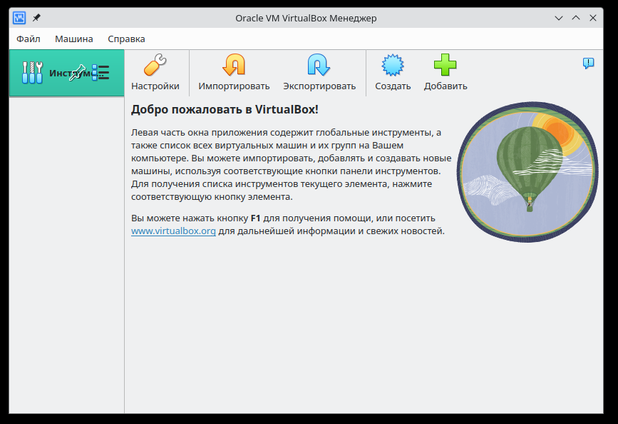
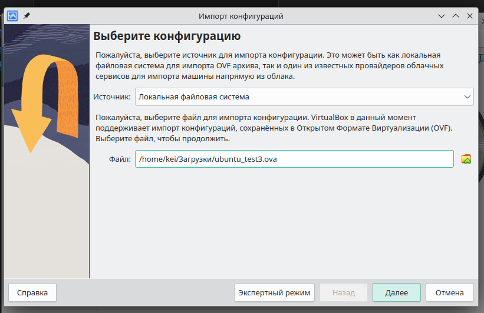
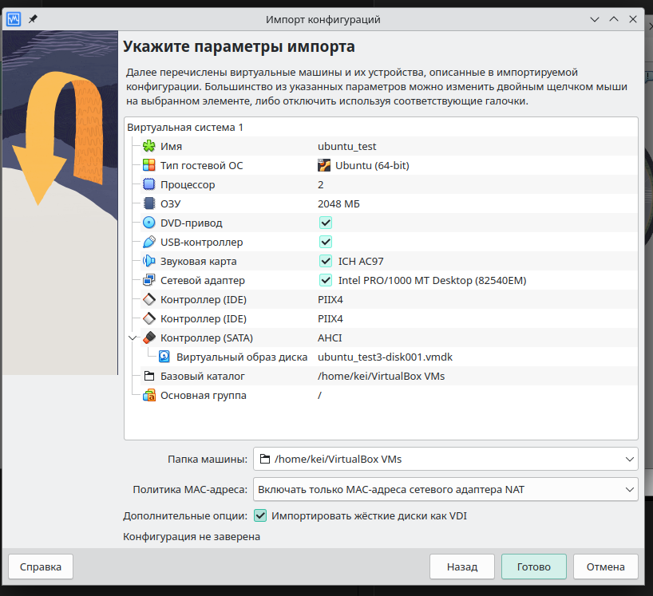
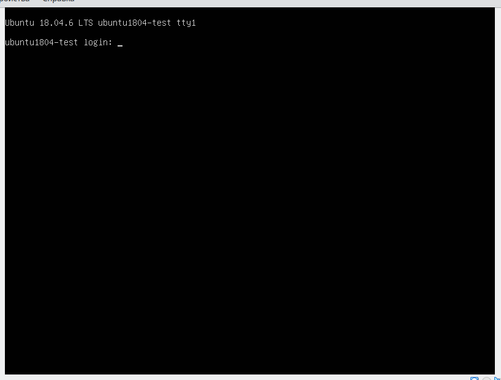
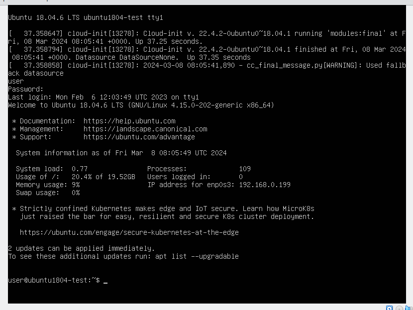
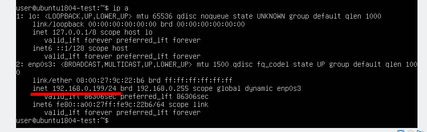
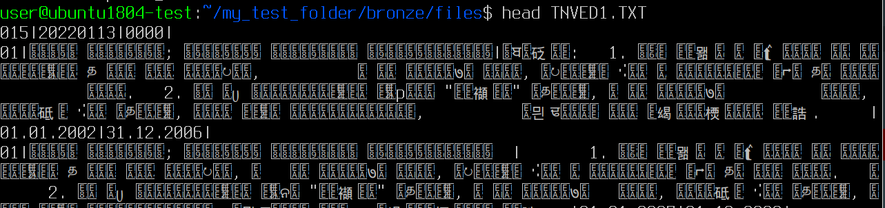
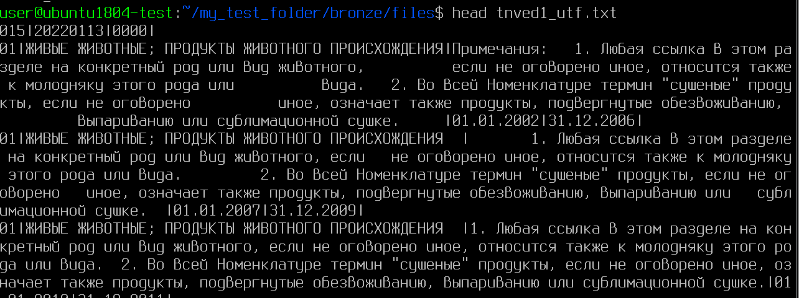
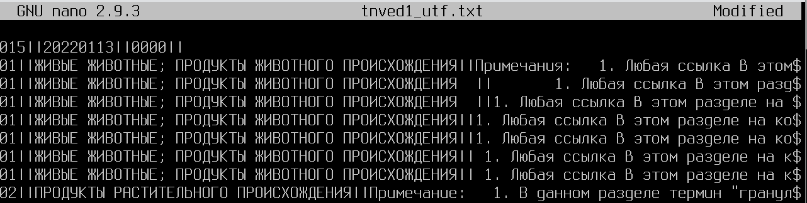

# Практика №1. Настройка и использование ОС Linux в качестве файловой системы

1. Установили VirtualBox

    

1. Импортировали загруженный образ Ubuntu

    

1. Посмотрели параметры (в итоге поменяли сетевой адаптер)

    

1. Запустили образ Ubuntu

    

1. Залогинились пользователем user

    

1. Результат команды `man top`

    ```
    TOP(1)                                User Commands                               TOP(1)

    NAME
        top - display Linux processes

    SYNOPSIS
        top -hv|-bcHiOSs -d secs -n max -u|U user -p pid -o fld -w [cols]

        The traditional switches `-' and whitespace are optional.

    DESCRIPTION
        The  top  program  provides a dynamic real-time view of a running system.  It can
        display system summary information as well as a list of processes or threads cur‐
        rently  being  managed by the Linux kernel.  The types of system summary informa‐
        tion shown and the types, order and size of information displayed  for  processes
        are  all  user  configurable and that configuration can be made persistent across
        restarts.

        The program provides a limited interactive interface for process manipulation  as
        well  as  a  much more extensive interface for personal configuration  --  encom‐
        passing every aspect of its operation.  And while top is referred  to  throughout
        this  document,  you  are  free  to name the program anything you wish.  That new
        name, possibly an alias, will then be reflected on top's display  and  used  when
        reading and writing a configuration file.

    OVERVIEW
    Documentation
        The remaining Table of Contents

            OVERVIEW
                Operation
                Startup Defaults
    ```

1. Результат работы команды `top`

    ```
    top - 08:24:23 up 19 min,  2 users,  load average: 0.00, 0.07, 0.19
    Tasks: 106 total,   1 running,  56 sleeping,   0 stopped,   0 zombie
    %Cpu(s):  0.0 us,  0.3 sy,  0.0 ni, 99.5 id,  0.0 wa,  0.0 hi,  0.2 si,  0.0 st
    KiB Mem :  2040712 total,   331776 free,   126292 used,  1582644 buff/cache
    KiB Swap:  2097148 total,  2096880 free,      268 used.  1725976 avail Mem
    ```

    Всего памяти 2Гб, используется 126Мб + 1,58Гб

1. Получили адрес сетевого адаптера командой `ip a`

    


1. В хосте зашли в консоль гостевой ОС через SSH

    ```
    ssh user@192.168.0.199
    ```

    ```
    ~/Изображения$ ssh user@192.168.0.199
    The authenticity of host '192.168.0.199 (192.168.0.199)' can't be established.
    ED25519 key fingerprint is SHA256:wcFD67WWvzao4xyR4pu//Z0gAjFXnbGEVjsWO4tHQ24.
    This key is not known by any other names.
    Are you sure you want to continue connecting (yes/no/[fingerprint])? yes
    Warning: Permanently added '192.168.0.199' (ED25519) to the list of known hosts.
    user@192.168.0.199's password:
    ```

    Авторизовались:

    ```
    Welcome to Ubuntu 18.04.6 LTS (GNU/Linux 4.15.0-202-generic x86_64)

    * Documentation:  https://help.ubuntu.com
    * Management:     https://landscape.canonical.com
    * Support:        https://ubuntu.com/advantage

    System information as of Fri Mar  8 08:09:24 UTC 2024

    System load:  1.06               Processes:             122
    Usage of /:   21.7% of 19.52GB   Users logged in:       1
    Memory usage: 15%                IP address for enp0s3: 192.168.0.199
    Swap usage:   0%

    * Strictly confined Kubernetes makes edge and IoT secure. Learn how MicroK8s
    just raised the bar for easy, resilient and secure K8s cluster deployment.

    https://ubuntu.com/engage/secure-kubernetes-at-the-edge

    72 updates can be applied immediately.
    44 of these updates are standard security updates.
    To see these additional updates run: apt list --upgradable

    New release '20.04.6 LTS' available.
    Run 'do-release-upgrade' to upgrade to it.


    *** System restart required ***
    Last login: Fri Mar  8 08:05:48 2024
    user@ubuntu1804-test:~$
    ```

Просмотр текущего каталога

```
user@ubuntu1804-test:~$ pwd
/home/user
```

Создание структуры катлогов для практики:

```
user@ubuntu1804-test:~$ mkdir my_test_folder
user@ubuntu1804-test:~$ cd my_test_folder/
user@ubuntu1804-test:~/my_test_folder$ mkdir bronze
user@ubuntu1804-test:~/my_test_folder$ mkdir silver
user@ubuntu1804-test:~/my_test_folder$ mkdir gold
user@ubuntu1804-test:~/my_test_folder$ mkdir temp
user@ubuntu1804-test:~/my_test_folder$ cd bronze/
user@ubuntu1804-test:~/my_test_folder/bronze$ mkdir files
user@ubuntu1804-test:~/my_test_folder/bronze$ mkdir media
user@ubuntu1804-test:~/my_test_folder/bronze$ cd ../silver/
user@ubuntu1804-test:~/my_test_folder/silver$ mkdir files
user@ubuntu1804-test:~/my_test_folder/silver$ mkdir media
user@ubuntu1804-test:~/my_test_folder/silver$ cd ../gold
user@ubuntu1804-test:~/my_test_folder/gold$ mkdir files
user@ubuntu1804-test:~/my_test_folder/gold$ mkdir media
user@ubuntu1804-test:~/my_test_folder/gold$ cd ..
user@ubuntu1804-test:~/my_test_folder$ ls -R
.:
bronze  gold  silver  temp

./bronze:
files  media

./bronze/files:

./bronze/media:

./gold:
files  media

./gold/files:

./gold/media:

./silver:
files  media

./silver/files:

./silver/media:

./temp:
user@ubuntu1804-test:~/my_test_folder$ cd temp
user@ubuntu1804-test:~/my_test_folder/temp$ touch test.txt
user@ubuntu1804-test:~/my_test_folder/temp$ echo "Hello? its my first file in Linux!" > test.txt
user@ubuntu1804-test:~/my_test_folder/temp$ cat test.txt
Hello? its my first file in Linux!
user@ubuntu1804-test:~/my_test_folder/temp$ ls -l
total 4
-rw-rw-r-- 1 user user 35 Mar  8 08:38 test.txt
```

Загрузка архива из репозитория

```
user@ubuntu1804-test:~/my_test_folder/temp$ wget https://github.com/qwerty29544/BigDataEsse
ntials/raw/main/Practice1_LinuxCommands/data.tar.gz
--2024-03-08 08:42:58--  https://github.com/qwerty29544/BigDataEssentials/raw/main/Practice
1_LinuxCommands/data.tar.gz
Resolving github.com (github.com)... 140.82.121.3
Connecting to github.com (github.com)|140.82.121.3|:443... connected.
HTTP request sent, awaiting response... 302 Found
Location: https://raw.githubusercontent.com/qwerty29544/BigDataEssentials/main/Practice1_Li
nuxCommands/data.tar.gz [following]
--2024-03-08 08:42:59--  https://raw.githubusercontent.com/qwerty29544/BigDataEssentials/ma
in/Practice1_LinuxCommands/data.tar.gz
Resolving raw.githubusercontent.com (raw.githubusercontent.com)... 185.199.108.133, 185.199
.109.133, 185.199.110.133, ...
Connecting to raw.githubusercontent.com (raw.githubusercontent.com)|185.199.108.133|:443...
 connected.
HTTP request sent, awaiting response... 200 OK
Length: 40529920 (39M) [application/octet-stream]
Saving to: ‘data.tar.gz’

data.tar.gz            100%[===========================>]  38.65M  6.60MB/s    in 6.3s

2024-03-08 08:43:07 (6.16 MB/s) - ‘data.tar.gz’ saved [40529920/40529920]
```

Распаковка архива без подкаталогов

```
user@ubuntu1804-test:~/my_test_folder/temp$ tar -xvf data.tar.gz --strip-components 1
data/GAZ.csv
data/linux_logo.jpg
data/MIREA_Gerb_Colour.eps
data/MIREA_Gerb_Colour.jpg
data/MIREA_Gerb_Colour.png
data/okato.csv
data/oksm.csv
data/pizza_orders.db
data/TNVED1.TXT
data/TNVED2.Txt
data/TNVED3.Txt
user@ubuntu1804-test:~/my_test_folder/temp$ ls -l
total 79176
-rw-rw-r-- 1 user user 40529920 Mar  8 08:43 data.tar.gz
-rw-r--r-- 1 user user  2283356 Feb  6  2023 GAZ.csv
-rw-r--r-- 1 user user    20383 Feb  6  2023 linux_logo.jpg
-rw-r--r-- 1 user user 17862074 Jan 13  2019 MIREA_Gerb_Colour.eps
-rw-r--r-- 1 user user  1117105 Jan 13  2019 MIREA_Gerb_Colour.jpg
-rw-r--r-- 1 user user   128090 Jan 13  2019 MIREA_Gerb_Colour.png
-rw-r--r-- 1 user user 14391592 Feb  2  2023 okato.csv
-rw-r--r-- 1 user user    17736 Feb  2  2023 oksm.csv
-rw-r--r-- 1 user user  1576960 Feb  4  2023 pizza_orders.db
-rw-rw-r-- 1 user user       35 Mar  8 08:38 test.txt
-rw-r--r-- 1 user user   153249 Feb  2  2023 TNVED1.TXT
-rw-r--r-- 1 user user  1788645 Feb  2  2023 TNVED2.Txt
-rw-r--r-- 1 user user  1181395 Feb  2  2023 TNVED3.Txt
```

Перенос графических файлов в `bronze/media`

```
user@ubuntu1804-test:~/my_test_folder/temp$ mv *.eps ../bronze/media/
user@ubuntu1804-test:~/my_test_folder/temp$ mv *.png ../bronze/media/
user@ubuntu1804-test:~/my_test_folder/temp$ mv *.jpg ../bronze/media/
```

```
user@ubuntu1804-test:~/my_test_folder/temp$ cd ../bronze/media/
user@ubuntu1804-test:~/my_test_folder/bronze/media$ ls -l
total 18684
-rw-r--r-- 1 user user    20383 Feb  6  2023 linux_logo.jpg
-rw-r--r-- 1 user user 17862074 Jan 13  2019 MIREA_Gerb_Colour.eps
-rw-r--r-- 1 user user  1117105 Jan 13  2019 MIREA_Gerb_Colour.jpg
-rw-r--r-- 1 user user   128090 Jan 13  2019 MIREA_Gerb_Colour.png
```

Переименование герба

```
user@ubuntu1804-test:~/my_test_folder/bronze/media$ mv MIREA_Gerb_Colour.png MIREA_gerb_rgb.png
user@ubuntu1804-test:~/my_test_folder/bronze/media$ mv MIREA_Gerb_Colour.jpg MIREA_gerb_rgb.jpg
user@ubuntu1804-test:~/my_test_folder/bronze/media$ mv MIREA_Gerb_Colour.eps MIREA_gerb_rgb.eps
user@ubuntu1804-test:~/my_test_folder/bronze/media$ ls -l
total 18812
-rw-r--r-- 1 user user    20383 Feb  6  2023  linux_logo.jpg
-rw-r--r-- 1 user user 17862074 Jan 13  2019  MIREA_gerb_rgb.eps
-rw-r--r-- 1 user user  1117105 Jan 13  2019  MIREA_gerb_rgb.jpg
-rw-r--r-- 1 user user   128090 Jan 13  2019  MIREA_gerb_rgb.png
```

Просмотр первых строк файлов

```
user@ubuntu1804-test:~/my_test_folder/bronze/media$ head MIREA_gerb_rgb.eps
 {::S%!PS-Adobe-3.1 EPSF-3.0
%ADO_DSC_Encoding: Windows Cyrillic
%%Title: MIREA_Gerb_Colour.eps
%%Creator: Adobe Illustrator(R) 15.0
%%For: 4
%%CreationDate: 1/10/2019
%%BoundingBox: 0 0 590 651
%%HiResBoundingBox: 0 0 589.2051 650.8003
%%CropBox: 0 0 589.2051 650.8003
%%LanguageLevel: 2
```

```
user@ubuntu1804-test:~/my_test_folder/bronze/media$ head MIREA_gerb_rgb.png
PNG

IHDR9  pHYs
OiCCPPhotoshop ICC profilexڝSgTS=BKKoR RB&*!      J!QEEQ,
!{kּ>H3Q5B.@
$pd!s#~<<+"xM0B\t8@zB@F&S`cbP-`'{[!
```

Перенос тесктовых файлов в `bronze/files`

```
user@ubuntu1804-test:~/my_test_folder/temp$ mv *.txt ../bronze/files
user@ubuntu1804-test:~/my_test_folder/temp$ mv *.TXT ../bronze/files
user@ubuntu1804-test:~/my_test_folder/temp$ mv *.csv ../bronze/files
user@ubuntu1804-test:~/my_test_folder/temp$ mv *.db ../bronze/files
user@ubuntu1804-test:~/my_test_folder/temp$ ls
data  data.tar.gz  TNVED2.Txt  TNVED3.Txt
user@ubuntu1804-test:~/my_test_folder/temp$ mv *.Txt ../bronze/files
```

Просмотр первых строк файла



Просмотр кодировки файла

```
user@ubuntu1804-test:~/my_test_folder/bronze/files$ file -i TNVED1.TXT
TNVED1.TXT: text/plain; charset=unknown-8bit
```

Смена кодировки файла

```
user@ubuntu1804-test:~/my_test_folder/bronze/files$ iconv -f CP866 -t UTF-8 TNVED1.TXT -o tnved1_utf.txt
```

Просмотр кодировки файла

```
user@ubuntu1804-test:~/my_test_folder/bronze/files$ file -i tnved1_utf.txt
tnved1_utf.txt: text/plain; charset=utf-8
```

Просмотр первых строк файла



Смена кодировки остальных файлов

```
user@ubuntu1804-test:~/my_test_folder/bronze/files$ iconv -f CP866 -t UTF-8 TNVED1.TXT -o tnved2_utf.txt
user@ubuntu1804-test:~/my_test_folder/bronze/files$ iconv -f CP866 -t UTF-8 TNVED3.Txt -o tnved3_utf.txt
user@ubuntu1804-test:~/my_test_folder/bronze/files$ ls
GAZ.csv    oksm.csv         test.txt    tnved1_utf.txt  tnved2_utf.txt  tnved3_utf.txt 
okato.csv  pizza_orders.db  TNVED1.TXT  TNVED2.Txt      TNVED3.Txt
```

Перенос перекодированных файлов в `silver/files`

```
user@ubuntu1804-test:~/my_test_folder/bronze/files$ mv tnved*_utf.* ../../silver/files/
```

```
user@ubuntu1804-test:~/my_test_folder/bronze/files$ cd ../../silver/files/
user@ubuntu1804-test:~/my_test_folder/silver/files$ ls -l
total 2496
-rw-rw-r-- 1 user user  267224 Mar  8 09:15 tnved1_utf.txt
-rw-rw-r-- 1 user user  267224 Mar  8 09:18 tnved2_utf.txt
-rw-rw-r-- 1 user user 2013503 Mar  8 09:18 tnved3_utf.txt
```

Замена символа `|` на `||` с помощью редактора nano

Командой `^\` перейти в режим замены, `^o` - сохранить, `^x` - выйти




```
user@ubuntu1804-test:~/my_test_folder/silver/files$ nano tnved1_utf.txt
user@ubuntu1804-test:~/my_test_folder/silver/files$ nano tnved2_utf.txt
user@ubuntu1804-test:~/my_test_folder/silver/files$ nano tnved3_utf.txt
user@ubuntu1804-test:~/my_test_folder/silver/files$ mv tnved*_utf.txt ../../gold/files/
```

Иоговая структура файлов

```
user@ubuntu1804-test:~/my_test_folder$ ls -R
.:

bronze  gold  silver  temp

./bronze:
files  media

./bronze/files:
GAZ.csv    oksm.csv         test.txt    TNVED2.Txt
okato.csv  pizza_orders.db  TNVED1.TXT  TNVED3.Txt

./bronze/media:
 linux_logo.jpg      MIREA_gerb_rgb.eps   MIREA_gerb_rgb.png
 MIREA_gerb_rgb.jpg

./gold:
files  media

./gold/files:
tnved1_utf.txt  tnved2_utf.txt  tnved3_utf.txt

./gold/media:

./silver:
files  media

./silver/files:

./silver/media:

./temp:
data.tar.gz
```
